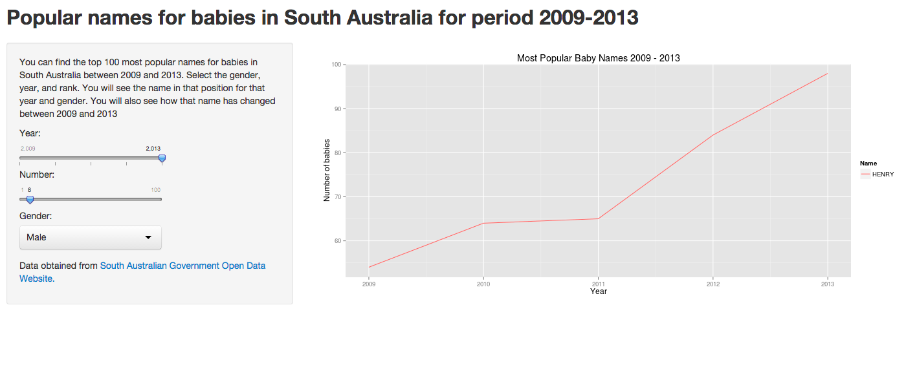

Popular Baby Names in South Australia in the Period 2009 - 2013 
========================================================
author: Raul Caceres
date: April 18, 2015

Why are names important? 
========================================================

Research shows that names can determine success in life. Research shows a few important points: 

- Research carried out by the New York University's Stern School found that easy to pronounce names made people more likable and successful 
- Names that are too eccentric can lead to children being bullied at school 
- For some children, having others with the same name can help them feel more secure

Helping parents choose popular names
========================================================

I have created this very useful application using open government data from the government of South Australia to help parents choose based on the top 100 most popular names for baby boys and baby girls


```r
head(boys_data)
```

```
     Name Number Gender Year Rank
1  OLIVER    170   Male 2013    1
2 WILLIAM    118   Male 2013    2
3    NOAH    111   Male 2013    3
4    JACK    106   Male 2013    4
5   ETHAN    105   Male 2013    5
6   MASON    101   Male 2013    6
```


How to use the baby names application
========================================================
<br>
To make use of the app you need to follow 3 very easy steps
- Select the year you want to explore
- Select the rank of the name you want to see
- Select if you want to explore baby boys or baby girls names

About this application
========================================================
This application was prepared using <a href="https://data.sa.gov.au/dataset/popular-baby-names">open government data</a> from South Australia.<br>
You can see the live application at https://totocol.shinyapps.io/dataproductsproject/ <br>
This was also prepared as part of the Data Scientist course from Coursera. Thanks for all the learning! 

publish(title = 'Coursera', 'index.html', host = 'rpubs')
